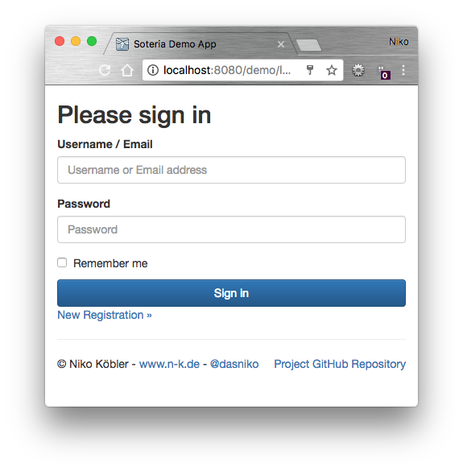
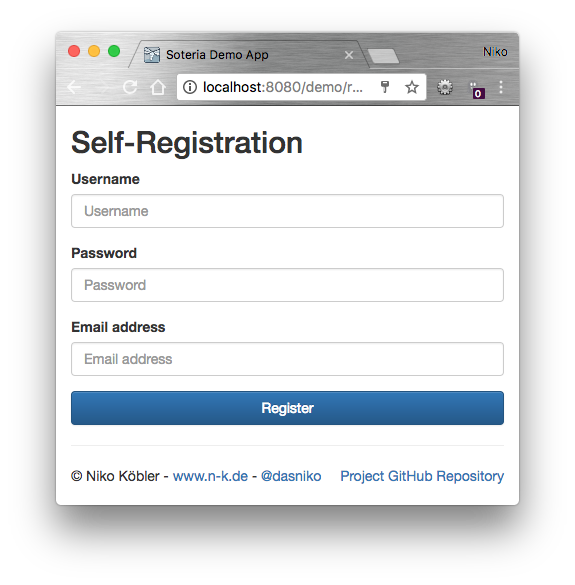

# JavaEE 8 Soteria MVC Demo</name>

Custom MVC Demo for Java EE 8 [Security API (JSR-375)](https://github.com/javaee-security-spec) [RI Soteria](https://github.com/javaee/security-soteria)

UI technology used is [MVC 1.0, RI Ozark](https://www.mvc-spec.org).

## Runtime Environment

This demo is created to run in a JBoss Wildfly 11 application server.

## Persistence

The datasource used for data persistence is the `ExampleDS` H2 in-memory datasource, which comes per default with every Wildfly server.
So you don't need to set up a separate database for using this demo.

Hibernate is configured to create/update the schema on startup (`hibernate.hbm2ddl.auto = update`).
If you start using this application, consider you have an empty schema w/o data.
